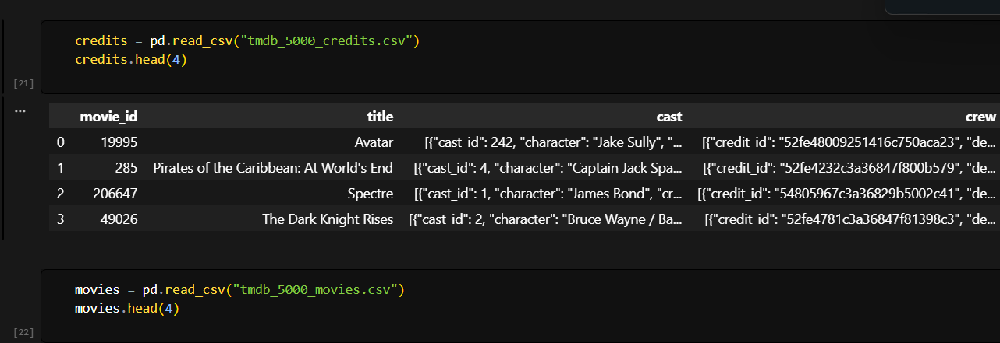
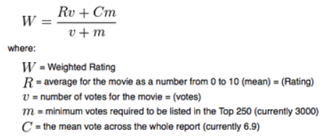
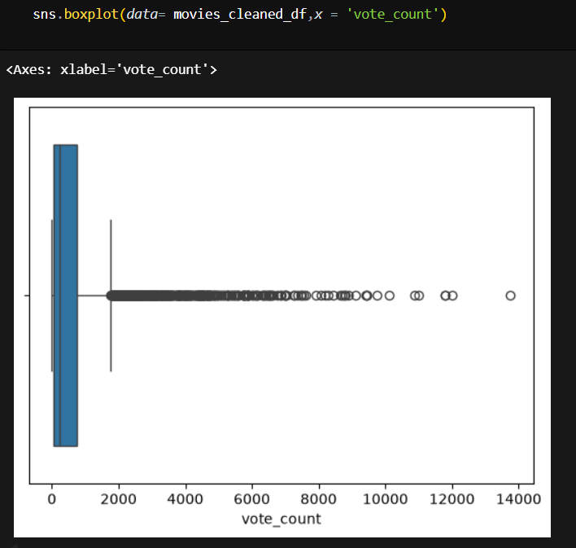
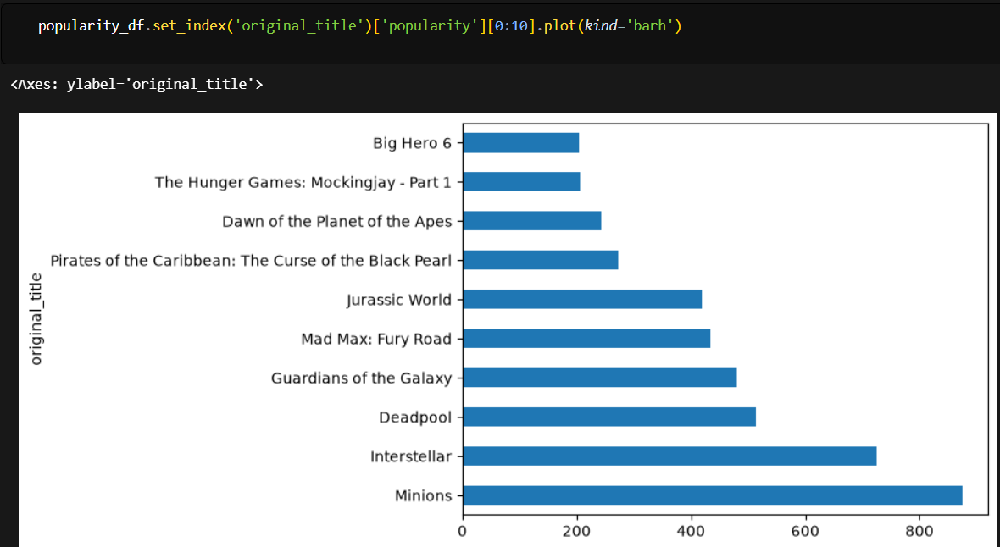
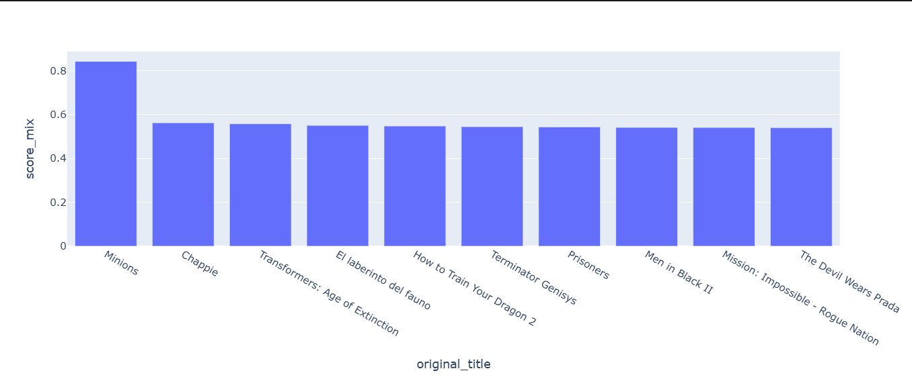
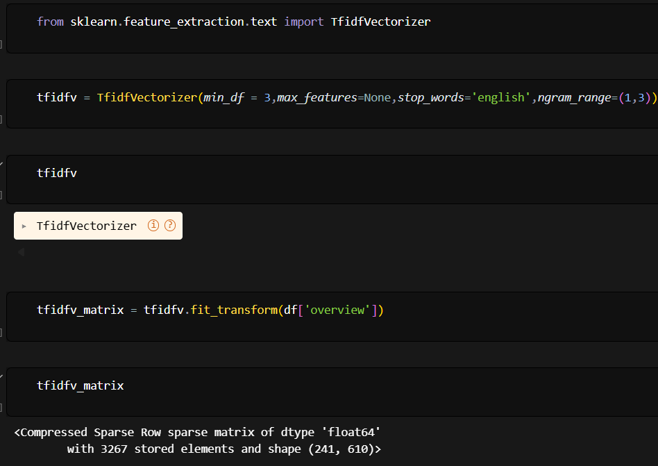
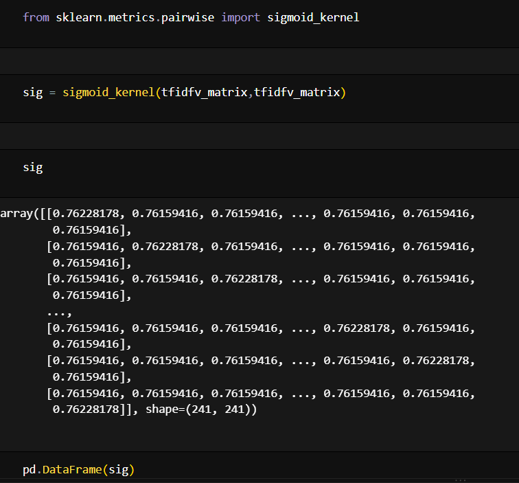

# 🎬 TMDB Movie Recommendation System

### Content-Based Movie Recommendation using NLP, TF-IDF & Similarity

> **“Why did the system recommend that movie?”**

This project builds a **content-based movie recommendation system** using the **TMDB 5000 dataset**.

The system analyzes movie information, ratings, popularity and textual movie overviews to identify movies that are similar to a selected movie.

The project combines **Data Analysis, Ranking Techniques, Natural Language Processing (NLP), TF-IDF Vectorization and Similarity Calculation** to generate movie recommendations.

---

##  Project Overview

Movie recommendation systems help users discover relevant movies from large collections of content.

In this project, I developed a **content-based recommendation system** where movies are recommended based on the similarity of their textual descriptions.

The complete workflow is:

**Data Collection → Data Preparation → Rating Analysis → Popularity Analysis → Hybrid Ranking → NLP → TF-IDF → Similarity → Recommendation**

---

##  Project Objective

The main objectives of this project are:

- Analyze movie ratings and popularity.
- Calculate reliable weighted movie ratings.
- Create a balanced ranking using rating and popularity.
- Process movie descriptions using NLP.
- Convert movie overviews into numerical representations using TF-IDF.
- Calculate similarity between movies.
- Generate the **Top 10 movies similar to a selected movie**.

---

# Dataset


The project uses the **TMDB 5000 Movies dataset**.

Two datasets were used:

- `tmdb_5000_movies.csv`
- `tmdb_5000_credits.csv`

The datasets were merged using the common **movie ID**.

The final dataset contains approximately **4,803 movies**.

### Important Features

| Feature | Description |
|---|---|
| `title` | Movie title |
| `overview` | Movie description |
| `vote_average` | Average movie rating |
| `vote_count` | Number of votes |
| `popularity` | Movie popularity score |

---

#  Data Preparation

The datasets were cleaned and prepared before analysis.

### Main steps

- Renamed `movie_id` to `id` for dataset alignment.
- Merged the Movies and Credits datasets using `id`.
- Removed unnecessary columns such as:
  - `homepage`
  - `title_x`
  - `title_y`
  - `status`
  - `production_countries`

The cleaned dataset was then used for rating analysis, popularity analysis and recommendation.

---

#  Rating Analysis

Movie ratings were analyzed using:

- `vote_average`
- `vote_count`

A movie with a high average rating but very few votes may not provide a reliable ranking.

Therefore, a minimum vote threshold was determined using the **95th percentile of vote count**.

Movies below this threshold were filtered before calculating weighted ratings.

---

#  Weighted Rating



similarity-analysis

A weighted rating approach was used to balance:

- Movie rating
- Number of votes

The calculation considers:

- **R** → Movie's average rating
- **v** → Number of votes
- **C** → Overall average rating
- **m** → Minimum vote threshold

This produces a more reliable ranking than using average rating alone.

### Why Weighted Rating?

For example, a movie with:

> ⭐ 9.5 rating from 10 votes

should not automatically rank above:

> ⭐ 8.8 rating from thousands of votes.

Weighted rating helps reduce this problem by considering the number of votes.

---

# 🔥 Popularity Analysis

Movie popularity was analyzed separately from rating.

Movies were sorted according to their **popularity score** to identify the most popular movies in the dataset.

This provides another perspective for ranking movies.

### Rating vs Popularity

- **Weighted Rating** → focuses on rating reliability.
- **Popularity** → focuses on how popular a movie is.

---

#  Hybrid Ranking

To combine both perspectives, a hybrid ranking approach was created.

First, weighted rating and popularity were scaled using:

**MinMaxScaler**

Then they were combined using equal weights:

- **50% Weighted Rating**
- **50% Popularity**

### Hybrid Score

```text
Hybrid Score =
0.5 × Scaled Weighted Rating
+
0.5 × Scaled Popularity
````

This creates a balanced ranking that considers both **movie quality and popularity**.

> Note: This hybrid score is a ranking/analysis technique, not a trained machine learning model.

---

#  Natural Language Processing (NLP)

The **`overview`** column was used as the main textual feature.

Movie overviews contain useful information about:

* Story
* Characters
* Themes
* Events
* Movie concepts

NLP was used to convert this textual information into numerical representations that can be compared mathematically.

### NLP Pipeline

```text
Movie Overview
       ↓
Text Processing
       ↓
TF-IDF Vectorization
       ↓
Numerical Representation
       ↓
Similarity Calculation
```

---

#  TF-IDF Vectorization

**TF-IDF (Term Frequency–Inverse Document Frequency)** was applied to the movie overviews.

TF-IDF converts text into numerical vectors based on the importance of words within the movie descriptions.

### Configuration

```python
TfidfVectorizer(
    min_df=3,
    max_features=None,
    ngram_range=(1,3),
    stop_words="english"
)
```

### Parameters

| Parameter              | Purpose                                 |
| ---------------------- | --------------------------------------- |
| `min_df=3`             | Ignores extremely rare terms            |
| `ngram_range=(1,3)`    | Uses unigrams, bigrams and trigrams     |
| `stop_words="english"` | Removes common English words            |
| `max_features=None`    | Does not impose a maximum feature limit |

The result is a **TF-IDF matrix** representing the textual characteristics of the movies.

---

#  Similarity Calculation

After converting movie overviews into TF-IDF vectors, similarity between movies was calculated using the **sigmoid kernel**.

The similarity score represents how closely two movie descriptions are related.

### Important clarification

The sigmoid kernel used here is a **similarity function**.

It is **not** a neural-network sigmoid activation function.

---

#  Content-Based Recommendation

The recommendation engine works by comparing the selected movie with other movies.

### Recommendation Pipeline

```text
Selected Movie
      ↓
Movie Overview
      ↓
TF-IDF Representation
      ↓
Similarity Scores
      ↓
Sort Similarity Scores
      ↓
Remove Selected Movie
      ↓
Top 10 Similar Movies
```

The system finds the similarity scores for the selected movie, sorts them in descending order and returns the **Top 10 most similar movies**.

---

#  Project Output

The recommendation system generates a ranked list of movies similar to the selected movie.

### Recommendation Output


---

### Rating Analysis



### Popularity Analysis







### TF-IDF / Similarity Analysis






> Use your own screenshots and keep the image names consistent with the `images` folder.

---

#  Technologies Used

### Programming

* Python

### Data Analysis

* Pandas
* NumPy

### Visualization

* Matplotlib
* Seaborn

### Machine Learning / Data Processing

* Scikit-learn
* MinMaxScaler

### Natural Language Processing

* TF-IDF Vectorization

### Recommendation

* Sigmoid Kernel
* Content-Based Filtering

### Dataset

* TMDB 5000 Movies Dataset

---

#  Project Structure

```text
Movie_Recommendation_System/
│
├── TMDB Movie Recommendation.ipynb
│
├── tmdb_5000_movies.csv
├── tmdb_5000_credits.csv
│
├── images/
│   ├── recommendation-output.png
│   ├── rating-analysis.png
│   ├── popularity-analysis.png
│   └── similarity-analysis.png
│
└── README.md
```

---

#  Key Learnings

Through this project, I worked with:

* Real-world movie datasets
* Data cleaning and preparation
* Rating analysis
* Weighted ranking
* Popularity analysis
* Feature scaling
* Hybrid ranking
* Natural Language Processing
* TF-IDF vectorization
* Text similarity
* Content-based recommendation systems

Most importantly, this project helped me understand how **textual information can be transformed into numerical features and used to build recommendation systems**.


#  About Me

 **Divya Upadhyay**


### Connect with me

🔗 **GitHub:**
[https://github.com/CyberWol-12](https://github.com/CyberWol-12)

🔗 **LinkedIn:**
[https://linkedin.com/in/divya-upadhyay-a77060348](https://linkedin.com/in/divya-upadhyay-a77060348)


